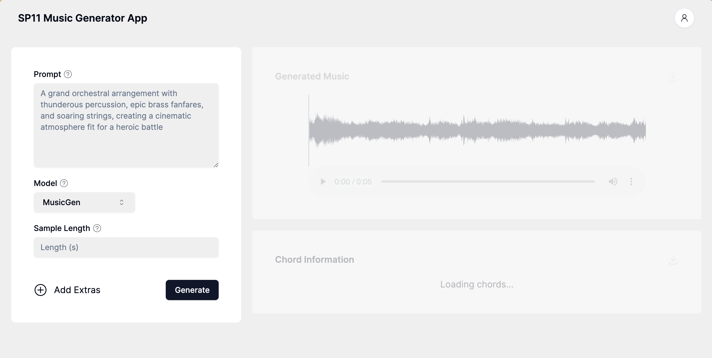
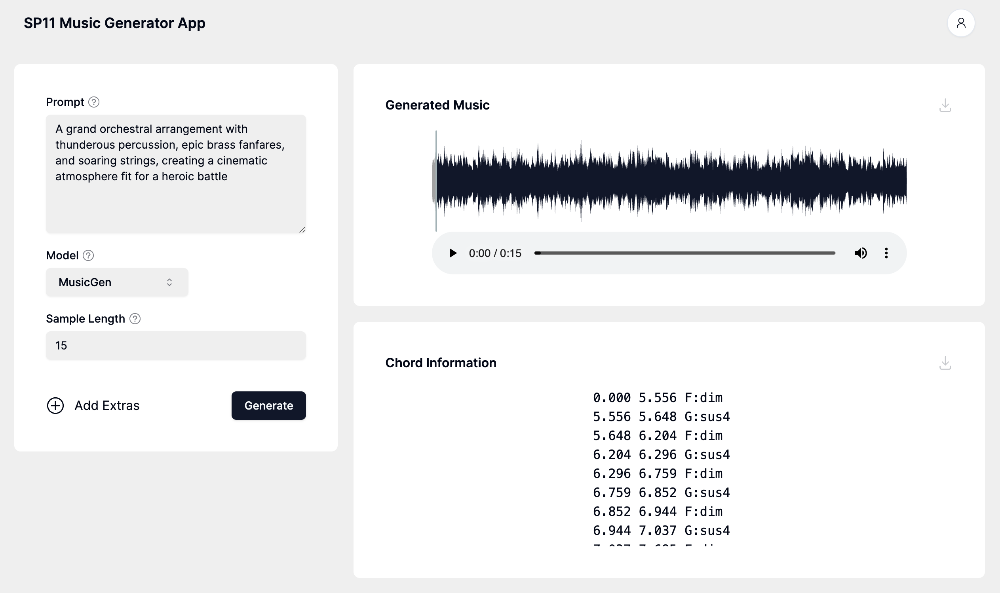
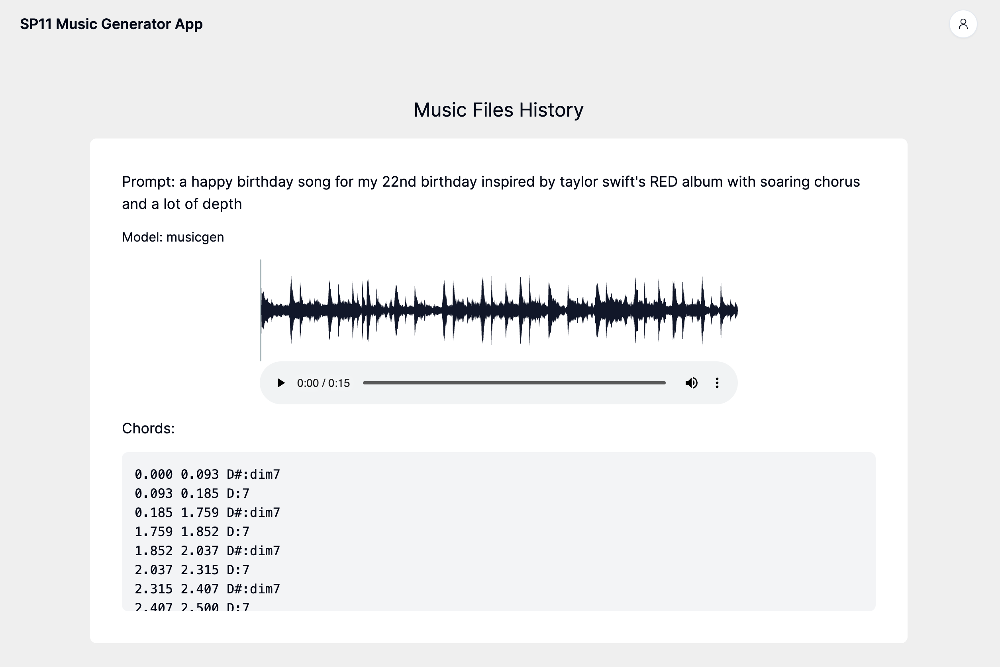

# Ailegro: Harnessing AI’s Power in Music Generation

By Sarah Dickerson, Komal Bhargava, Richard Pham, Gaurav Belani, Nila Shibu, Sean Springer

## Introduction

Ailegro stands at the forefront of innovation in music composition, leveraging AI to provide users with a seamless platform for their musical creativity. Our aim is to create an accessible yet versatile music production application that balances simplicity for beginners and hobbyists with advanced features for further tuning, thereby widening access to quality music production for a broader audience. Our application is capable of creating personalized music for our users through the use of four different AI models: MusicGen, Riffusion, Loop Test, Dance Diffusion. Additionally, Ailegro has an incorporated chord recognition model that enables automatic recognition and analysis of chord progressions within compositions.

## Demo

### Screenshots

_Landing Dashboard_

_Generated Music Dashboard_

_History Page_

## Examples

| Prompt                                                                                                                                                                                                      | Sound Sample                                                                   |
| ----------------------------------------------------------------------------------------------------------------------------------------------------------------------------------------------------------- | ------------------------------------------------------------------------------ |
| "A grand orchestral arrangement with thunderous percussion, epic brass fanfares, and soaring strings, creating a cinematic atmosphere fit for a heroic battle"                                              | <audio src="public/sample_sounds/orchestral_arrangement.wav" controls></audio> |
| "An electrifying guitar solo that rides the crest of a high-energy rock band's wave, with crashing cymbals and gritty bass lines, embodying the spirit of rebellion and freedom"                            | <audio src="public/sample_sounds/2.wav" controls></audio>                      |
| "A mysterious and enchanting nocturne featuring a piano with a haunting melody, underscored by the subtle tension of a string quartet, evoking a moonlit journey through an ancient and mystical landscape" | <audio src="public/sample_sounds/3.wav" controls></audio>                      |
| "A joyful and lively folk dance with upbeat accordion rhythms, cheerful fiddles, and foot-tapping percussion, painting a scene of a vibrant village festival"                                               | <audio src="public/sample_sounds/4.wav" controls></audio>                      |
| "An underwater dreamscape created with shimmering synthesizers and mellow electronic beats, capturing the otherworldly beauty of an oceanic realm"                                                          | <audio src="public/sample_sounds/5.wav" controls></audio>                      |
| "A somber and reflective piano piece, with sparse notes echoing in the silence, evoking a sense of nostalgia and the bittersweet passage of time"                                                           | <audio src="public/sample_sounds/6.wav" controls></audio>                      |

## Build Instructions

1. Clone the repository
2. Install the required dependencies using `npm install`
3. Open the terminal and run `npm run next-dev` to start the server
4. Open another terminal and `cd api` and follow the README instructions to start the backend server
5. Open your browser and navigate to `http://localhost:3000/`
